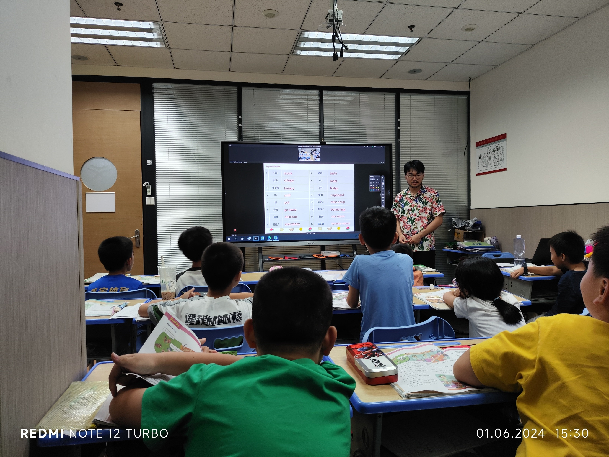
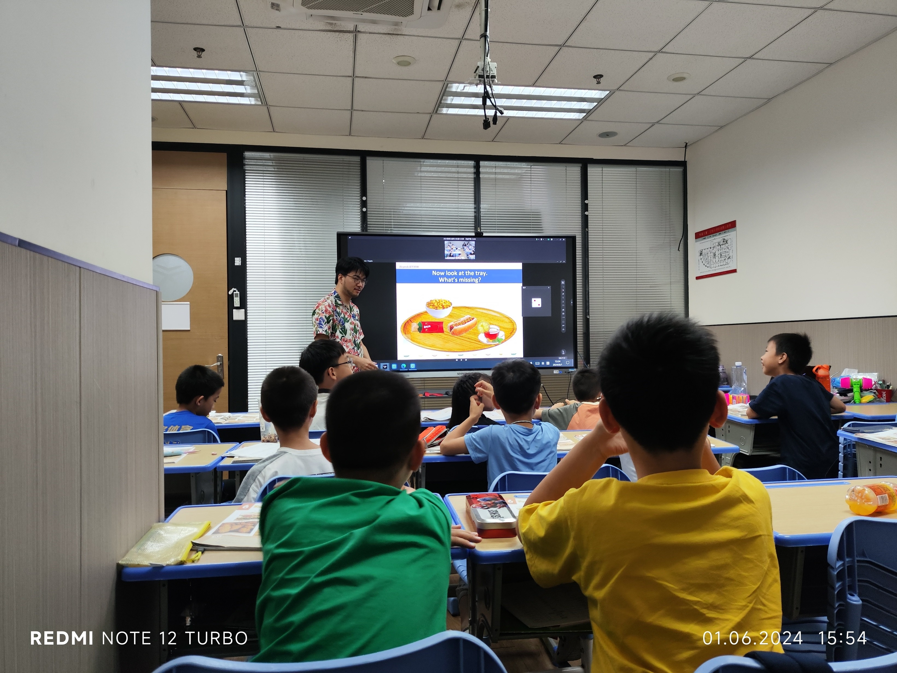

# 09 - 1 June - 2 睿学 - Jackie

## Workflow

- **Words review**
  - Dictation
  - Self-grading dictation
- **Homework self-grading**
- <badge>15:30</badge> New article
  - Introduce pictures
  - Introduce games
  - Children read by themselves; if they encounter difficulties, Jackie reads along.
  - Lead children to understand the article through simple questions and answers
  - Watch the article's video as a review
  - Advanced questions
- <badge>16:20</badge> Practice
  - **Textbook practice**: Children work on their own
  - **Textbook practice**: Children grade their own work
  - **Listening practice**: Children work on their own
  - **Listening practice**: Children grade their own work

## Quick Response

- Jackie says a number, and the children say the word.
  
- Jackie tells a riddle, and the children guess the word.
- "A hot?" - "Dog!" "A pi-?" - "zza!" "A chi-?" - "cken burger!"
- Jackie says words in Chinese, and the children say the words in English.
- "What is missing?" Remove something from an image, and let the children say what is missing.
  

## Others

- Use a stamp desk for questions.
- Use a 气锤 to warn misbehaving children.
- Encourage children to read aloud the questions and their answers; always encourage them to read by themselves.
- Prepare plenty of riddles.
- Standing up as punishment.
- A child says a number (1-6) first, then rolls the e-dice. If the numbers don't match, nothing happens.
- Use nearby items, like a bottle of water, to give hints to the children.
- Child: "他看着就是坏人" (He looks like a bad person); Jackie: "他看着就是坏的，像你一样" (He looks bad, like you) (the other children laughed).

## Body and Facial Language

- "Cut": One 'daddy finger' 'cuts' another 'daddy finger'.

## Classroom Language

- Yes or no?
- OK or not OK?
