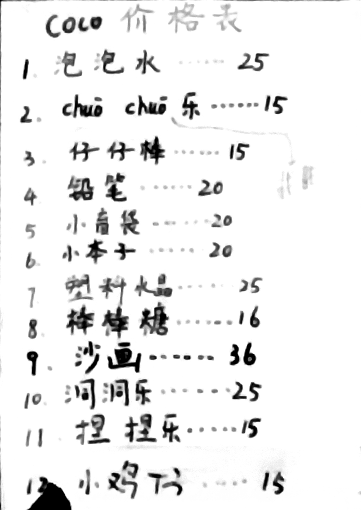

# 19 - 15. Jun. - 2精学 - Coco ⭐

## Workflow

- <badge>9:00</badge> **Review**
  - Lucky Number: Coco writes a lucky number on her hand in the range from 0 to 100. Each child guesses a number to narrow down the range. This game rewards children by reducing their homework, which they enjoy. Children tend to guess numbers close to the bounded number, making the game take longer. Coco encourages them to "be quick" or "hurry up," but this isn’t very effective. A possible better prompt could be, for example, "The lucky number is far from 92."
  - Fill-in-the-blanks: The children complete a fill-in-the-blank quiz together on the screen, based on what they learned in the last lesson. Coco provides the phonics for each word filled in. (This can be tiring for teachers.)
  - Vocabulary Dictation: The children often complain. Some finish quickly, and Coco grades their dictations.
- <badge>9:20</badge> **Grammar Learning**
  - The children raise their books to show they are ready. If a child becomes disruptive, they are placed in an isolated team. (This punishment is very effective, and the isolated child doesn’t cause further trouble.)
  - Coco points to a word on the screen and selects children to say it. The children are enthusiastic. It's unclear which team answers more, but awarding one point per team doesn't cause any controversy.
  - Grammar fill-in-the-blank quiz as an introduction.
  - Note-taking: Notes are divided into two parts, red and yellow. Red notes are mandatory, while yellow notes are optional as they mainly contain Chinese explanations. The children like to talk while taking notes. Coco takes photos of the notes. A countdown timer limits the time spent on this activity. When the countdown ends, Coco asks the children who have finished to raise their hands and awards points to the team with all members finished. The points depend on a dice roll. To be quick, Coco rolls the dice herself but clicks the screen to roll the dice until the children say "stop," which is faster than asking children to do it but still makes them feel involved.
  - For a question with three blanks, Coco selects one child from each team to answer, awarding one point per team. (Sisi advised not to assign different teams for different quizzes, as the varying difficulty could cause obvious unfairness.)
  - Coco selects two children from the same team to act out a conversation. They use paper, scissors, stone to decide who rolls the dice for points. (Since the children are already near the screen, it's better to let them click to roll the dice directly, as Coco does. However, a naughty boy clicked twice. Though it didn’t cause unfairness, many children expressed dissatisfaction, and Coco gave the boy a yellow card warning. So, it might be better for the teacher to handle the dice rolling, even if it’s more convenient for the children to do it themselves.)
  - All children practice the conversation and record videos. If a child doesn't have a partner, they practice with the teacher.
- <badge>10:20</badge> **Homework Check**
- <badge>10:30</badge> **Workbook**
  - If children finish the practice within a given time and have their work graded by Coco, they can earn a stamp.
  - Children who finish the practice and receive the promised stamps from Coco can leave once class is over. Slower children stay and continue working. (This flexible practice grading allows faster children to leave on time, which is fair and motivates children to work faster.)

## Classroom Language

- Once again
- One more time
- Heads up

## Others

- The children are divided into three teams, based on the seating arrangement in the classroom. (This strategy is natural but requires more attention from teachers to ensure all points are added correctly.)
- Coco misunderstands Hong Kong dollars and US dollars.
- Coco assigns a 'little teacher' to help other children with practice problems. (I didn't notice the 'little teacher' being particularly happy or excited. Perhaps teachers shouldn’t assign such tasks to children.)
- Coco promises to play games with the children if they complete their practice quickly. (This is actually a lie, I guess, as there is never enough time for teachers to do everything.)
- A lovely gift list on the wall!
  
