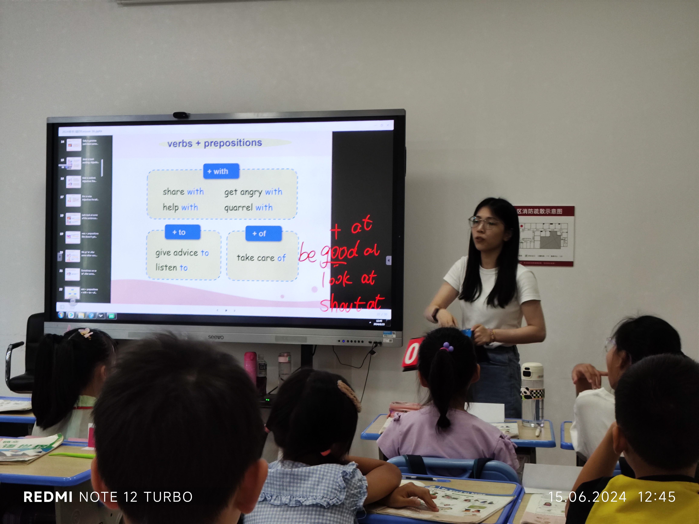

# 20 - 15. Jun. - 3 精学 - Rebecca ⭐

## Workflow

- **Before Class**

  - A phonics video from the last lesson's vocabulary is played. The children, however, are not very attentive and do their own things.
  - Homework is collected, and all graded workbooks from the previous lesson are distributed.
  - Rebecca takes attendance by calling out names, and the children respond.

- <badge>12:00</badge> **Review**

  - Rebecca begins the vocabulary review by showing only the Chinese words. The children then say the English equivalents, similar to an oral dictation.
  - All vocabulary words are explained. Rebecca’s examples are very engaging, such as 'Rebecca is generous because I share homework with you' and 'Because Rebecca eats children! (roars like a tiger).' (Rebecca’s examples are entertaining! Most jokes are self-deprecating or about the children, which is unusual and interesting. Jokes about Rebecca are generally fine, but jokes about the children should be handled carefully, as some might not understand they are just jokes and could feel upset.)
  - When 'understand' is listed, Rebecca also mentions 'understood' as the past tense form. Everyone then reads through a list of irregular verbs.
  - Six minutes of vocabulary dictation. Children can ask difficult questions (e.g., how to say 'quarrel'), and Rebecca grades the early-finished dictations. All children finish early, so Rebecca starts the irregular past tense dictation about two minutes earlier. During the two dictations, Rebecca also grades the homework.

- <badge>12:20</badge> **Grammar**

  - Nina's turn. (See below)
  - Rebecca reteaches the grammar part that Nina covered.
  - Practice session: Rebecca picks children to answer questions. Those who answer correctly roll the dice, and the number rolled is added to their group’s points.
  - Role play (conversation): Rebecca goes through all the words and sentences that will be used. They roll dice to choose which sentence to play. (Using a physical dice isn’t very effective as many children can’t see it clearly. An electronic dice on the screen might work better.)
  - Practice in LEW: Rebecca uses an E-book to show the questions and Seewo to take notes. She provides many examples so the children know what to focus on. A countdown timer is used to limit time. The answers are then checked.
  - Note-taking.

- <badge>13:20</badge> **Workbooks**

  - Rebecca gives examples and allows time for the children to practice.

- <badge>13:45</badge> **Homework Check**
- <badge>13:50</badge> **Phonics**

  - Rebecca leads the children in reading first.
  - Rebecca plays a video and asks the children to identify words they hear that contain the phonics part being learned today.

- <badge>13:55</badge> **Fun Corner**
  - Some interesting sayings are introduced. Rebecca hopes the children can guess the meanings, but they fail, so she explains them directly. (This is not Rebecca’s fault; the images and example sentences are insufficient for the children to guess the meanings. Providing a full conversation with more context might be better.)

## Classroom Language

- Everybody sit up.
- Take a seat.
- Take out your LEW.
- Let’s take a look.
- Look at this one.
- So everybody, turn to page...
- (Start a countdown) One, two, three, go!
- (After finishing practice) Good job! So what is the first one?

## Others

- Using a real dice!
- The scoreboard is placed too low. The points adding is not very visible, especially for the children sitting at the back.
- Rebecca seems to mispronounce 'adverb', placing the accent incorrectly.
- Rebecca speaks Chinese to show her anger.

# Nina

- Nina is a little nervous at the beginning.
- Cards and gifts for the children are well prepared.
- Beautiful slides and video games are prepared.
- Nina speaks very fluently.

# 十分钟试讲备课

Why is there an 's'?
Because the subject is 'she'. It's third-person singular.
Can I say 'Rebecca share'?
No, it's 'Rebecca shares'.
Can I say 'Rebecca not shares'?
Then how should I say it?
'Rebecca doesn’t shares?'
Is it correct?
'Rebecca doesn’t share.'

---

(Say verbs, let the children say the prepositions. Whichever group is louder gets a point.)

---

(Some implementation notes)

