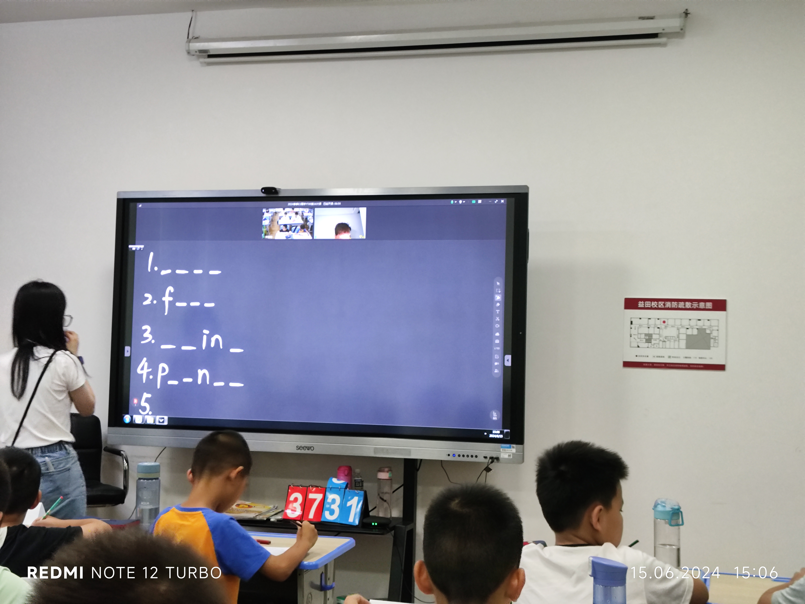

# 21 - 15. Jun. - 1 精学 - Rebecca

## Workflow

- <badge>15:00</badge> **Vocabulary Review**

  - Rebecca points to words and the children say them aloud.
  - Dictation: Rebecca writes some hints on the screen. If children ask, she repeats the previous vocabulary words.
    
  - Rebecca patrols and grades the completed dictations.

- <badge>15:20</badge> **Reading**

  - A brief look at the pictures in the reading sheet.
  - The children listen to the audio together.
  - Rebecca leads the children in reading the story and taking notes on the screen, which they should write down on their reading sheet. (Rebecca doesn’t explicitly tell the children to copy the notes, so some don’t follow until it is mentioned.)
  - Advanced questions.

- <badge>16:15</badge> **Phonics**

  - The children watch the first video and then discuss which words in the video include the 'u' sound.
  - They listen to a song for the first time and then sing it together the second time. Rebecca also asks which words in the song include the 'u' sound.
  - They add more 'u' sound words to the LEW. Rebecca takes notes on the screen for the children to copy.
  - They read the phonics practice sentences together, clapping or stamping for each 'u' sound. First, they do it together, then group by group.
  - They listen to a song about double 'p' when adding 'ing'. They listen first and then Rebecca leads them in singing.

- <badge>16:30</badge> **Practice**
- <badge>16:55</badge> **Homework Check**
  - Everyone repeat grammar jingles for the first time they encounter the grammar point in each section.
- <badge>17:05</badge> **Homework Assignment**

## Classroom Language

- Sorry, this is for demonstration so you can't eat it.
- Could you tell me...
- What does it look like?
- What else?
- Anything else?
- That is about... look here...
- (Summary) So we have done this...
- They are rhyming words.

## Others

- The example '"Rebecca" and "ka" are rhyming words' is not very appropriate.
- Rebecca rings a bell to remind the children to be quiet or behave well.
- Rebecca speaks Chinese to show her anger.

# Grace

- A little bit nervous and repeats the same phrases many times.
- Well-prepared items: a scrapbook, stickers, etc.
