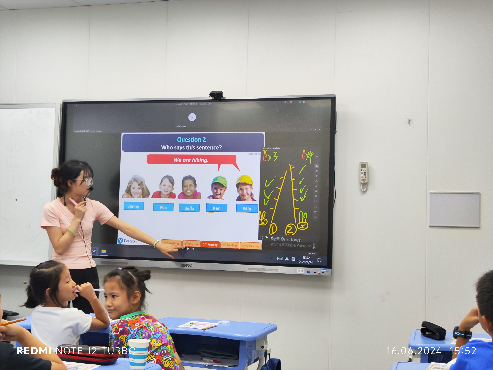
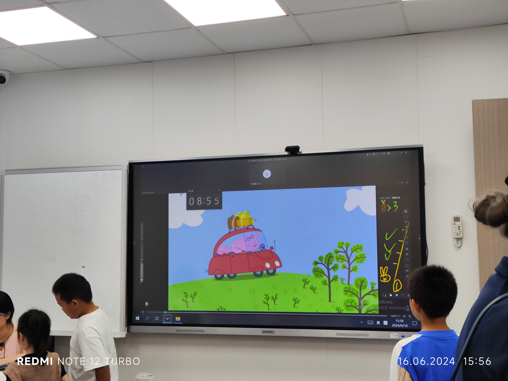

# 24 - 16. Jun. - 1 好学 - Icey

## Workflow

- <badge>15:00</badge> **Review**

  - Group reading
  - Children read the parts Icey selects.
  - Briefly introduce some extended knowledge.
  - Dictation: Icey says the words and their phonics, and the children write them down.
  - Play the video of _What Do You Like to Do?_ and ask the children to identify the actions shown in the video. (The video is only played halfway, stopping when the children become familiar with it and are ready to sing. This might not be ideal, as it would be better to let the children sing along.)

- <badge>15:15</badge> **Reading**

  - Children read silently for 2 minutes.
  - Introduce 'scrapbook': show a picture of a scrapbook, explain what it is, and teach the phonics of 'scrapbook' with clapping: scrap (clap), book (clap), scrapbook (clap clap).
  - Ask the children to draw a campsite on the story sheet.
  - For each picture: read the picture, take brief notes, allow 30 seconds for silent reading, then randomly select children to read the description text of the picture.
  - Advanced practice.

- <badge>15:55</badge> **Phonics**

  - Play the warm-up video and let the children dance along. Icey then stops the video suddenly, and the children ask, 'Icey Icey, how many rabbits can you see?' The children then group together based on the number Icey says. Allow 1 minute for the children to calm down after the game.
  - Phonics video: explain to the children what they will learn from the video, then play it. Some children find the video interesting, which is quite different from another class I observed. The video is played twice; the second time, the children are asked to find out which words contain the 'u' sound. (Instead of asking 'how many', it's better to ask 'which words'.)
  - Note-taking: the central circle is 'sun' with rays pointing to other words containing the 'u' sound.
  - 'ing' song: the children listen to the song and follow Icey's instructions to write down notes on more comprehensive 'ing' rules.

- <badge>16:30</badge> **Workbook**

  - Briefly explain to the children how to complete the quiz. (The explanation might not be very clear, or the children might not be listening carefully, so many do the listening practice incorrectly, and Icey has to replay the audio.)
  - The children grade their workbooks themselves.

- <badge>16:50</badge> **Review (for next week's exam)**

## Classroom Language

- Read what I tick

## Others

- A lovely rabbit race activity! However, there are some inconveniences:
  - It requires more time for pre-class preparation.
  - Since it takes 5 steps to earn a carrot, it's troublesome to deduct points in some cases, whether due to miscalculation or because of bad behaviour, which warrants point deduction.
    
- When Icey makes mistakes, she pretends it’s a test for the children.
- Icey explains 'verse' as 'two lines of a poem,' which is inaccurate.
  > A **verse** is one of the parts into which a poem, song, chapter of the Bible, or the Koran is divided.
- The recess cartoon's topic is the same as the reading material's topic. However, _Peppa Pig_ is not very appealing to Primary 3 children.
  
