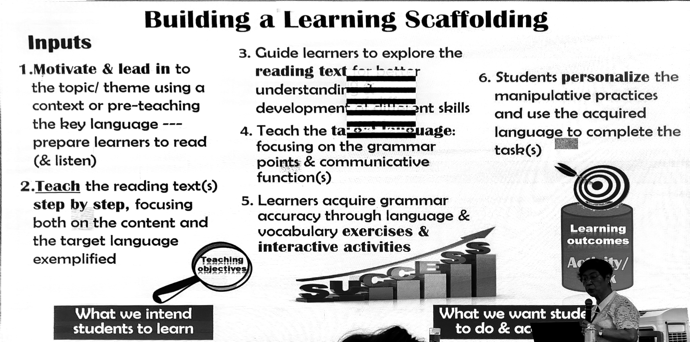

# Lilian Downey's Lecture

> [!note] My Thoughts
> 
> Lilian tells us the history, theory, and practical examples of modern language teaching.
>
> At the beginning of the lecture, we were asked why we chose education as a career. Personally, I like children. Though I seldom interact with them due to my personality, I adore their lovely faces and cute voices. This affection probably stems from my volunteering experience at the Guangxi Science Museum, where I enjoyed the atmosphere of children happily running around me.
>
> Regarding the history section, it was unfortunate that Lilian didn't have time to explain why the new methods are superior. For instance, the Grammar Translation Method and Audio-Lingual Approach are used in the smartphone application Duolingo, where I am learning German. I find these methods quite effective, especially when supported by modern technologies like 'auto sentence generating' and 'text to speech'. Even in our traditional classroom teaching, these methods are still employed when introducing grammar (to encourage children to discover patterns themselves). Although we don’t use these methods exclusively, many of their concepts remain relevant. Why, then, are they considered outdated? Lilian briefly mentioned that they only help students learn about the language system, not its practical use. While this reason is intuitive, the lecture lacked detailed comparisons and experiments, which I am curious about.
>
> At the end of the lecture, I had the chance to ask Lilian about it. She said, 'adopt an integrative approach', meaning all approaches are welcome if they suit the context. Sometimes new methods replace old ones, but sometimes old methods remain, especially when supported by contemporary technologies. In such cases, they can be even more useful than new approaches.
>
> In conclusion, I thank Lilian for introducing us to so many education-related theories, especially as an English major rather than an education major. As for all the demo classes, I can't remember them clearly as the content was quite scattered and most lacked a systematic and clear conclusion slide. I hope that next time, when I am more experienced, I will learn even more from Lilian.

## Table of Contents

[[toc]]

<!-- ## The History of ELT in Hong Kong

- Before the 1960s: Grammar Translation Method
- 1970s: Audio-Lingual Approach / Oral Structural Approach
- 1980s: Communicative Language Teaching (CLT)
- 1990s: Task-Based Learning Approach
- 2000s: Skills-Based / Genre-Based Teaching
- 2010s: Language Teaching Across the Curriculum
  - IT in Education
  - 21st Century Skills
  - Content and Language Integrated Learning (learning other subjects in English)
  - STEM / STEAM

## Methods

### Grammar Translation Method

e.g. 新概念英语

- Provide numerous examples and let children identify patterns.
- Focus solely on writing.
- Children learn about the language system, not its practical use.

### Audio-Lingual Approach

e.g. 英语 上海教育出版社

- Children learn vocabulary.
- Children imitate and watch; teachers act, and children identify.
- Emphasises listening and speaking.
- Target patterns are unnatural with little or no real meaning.

### Communicative Language Teaching

- Teach language in a communicative context.
- Provide a realistic context for the teaching sentences (e.g. a boy with a broken leg asks a girl what she can see outside the window).

### Task-Based Teaching

- Features: Context, Purpose, Process, Product, Skills & Knowledge

## Modern Teaching Focus

### Focus 1: 21st Century Skills

- Core values of the 21st century:
  - Respect
  - Responsibility
  - Resilience
  - Integrity
  - Care and concern
  - Harmony
- Social and emotional competencies:
  - Self-awareness
  - Self-management
  - Social awareness
  - Responsible decision-making
  - Relationship management
- Social and civic awareness:
  - Civic literacy
  - Global awareness
  - Cross-cultural skills
  - Critical and inventive thinking
  - Communication, collaboration, information skills

### Focus 2: The 9 Generic Skills

- **C**ommunication skills
- **C**ollaboration skills
- **C**ritical thinking skills
- **C**reativity
- **S**tudy skills
- **P**roblem-solving skills
- **I**nformation technology skills
- **N**umeracy skills
- **S**elf-management skills

('4Cs, spins' like a windmill with four blades spins.)

### Focus 3: Reading Across the Curriculum

- Learning English through other subjects (e.g. 'STEAM': Science, Technology, Engineering, Art, and Maths).
- Learning English through different text types.

### Focus 4: Values Education

Personal => Social => National => Cultural

## From English Teaching to English Education

### Language Skills & Components

- Skills: Listening, Reading, Speaking, Writing
- Components: Phonology, Lexis, Grammar

### Planning to Teach: Essential Considerations

- What to teach: The language focuses.
- Why teach it: Communicative functions.
- Who the learners are.
- What learners do at the end of the lesson: Exercises, activities, and/or tasks.
- How to support their learning: Scaffolding of learning.

### An Example of Task-Based Teaching

- A reason for the task.
- Step-by-step instructions:
  - Generating ideas (e.g. mind map).
  - Skill practice (e.g. letter structure).
- Analysis of the task:
  - Context: Corresponding with a friend.
  - Purpose: To inform something to the friend.
  - Process: Review facts about seasons and festivals; decide on one season and festival to write about; brainstorm ideas.
  - Product: A letter.
  - Skills & Knowledge: Vocabulary and sentences.
- Reading: Be Creative
  - Don't read directly. Try to engage children first.
  - While-reading stage: Read for gist and supporting details.
    - First reading: Summarise the gadget.
    - Second reading: Details.
    - Post-reading: Observe and extend learning.

 -->

## Lesson Planning

### Intro

- **What to teach**: Vocabulary, grammar, and information (e.g., disasters around the world).
- **Introduction (attract interest)**: Use questions, images, videos, and riddles to engage students. Describe the introduction materials without directly mentioning the key vocabulary, as this might not be intuitive for children.

### Vocabulary

> [!tip] What to teach
>
> - **How to pronounce & spell**
>   - Syllabication for correct spelling.
>   - Stressed & unstressed syllables for correct pronunciation & spelling.
> - **What it means**
>   - Definition to word.
>   - Word to explanation.
> - **How/when to use**
>   - Sentence making for correct usage in context.

- **Word Study**: Classify words according to pronunciation (e.g., number of syllables, stressed syllables, silent syllables).

### Reading

- **Reading**
  - **Pre-reading**: Guide students to predict content from the pictures in the text.
  - **First reading**: (Guided reading) Read aloud, followed by Q&A and explanations.
  - **Second reading**: Listen to the audio, then have students read silently or aloud.
  - **Post-reading**: Use graphic organisers to summarise the gist and key points. Assign comprehension questions.

- **Helping learners master the target language** through oral practices.
- **Provide a framework for planning speech**: Process writing (write, review, revise, rewrite) leading to presentation.

### Phonics

- **Reading Vocabulary**: Kitty, it is.
- **Phonics Vocabulary**: Big, six, sit, thin.
- **Rhyme Vocabulary**: This, hippo, fit.

### Storytelling Techniques

- **Language Input**: Include target vocabulary and structures from the text.
- **Exposure**: Use passive language and explain connections.
- **Repetition**: Repeat key sentences.
- **Audience Involvement**: Encourage responses, observations, anticipation, predictions, and imagination.
- **Dramatisation**: Use facial expressions, vocal effects, and gestures.

### Additional Points

- Chinese translation of terms is allowed, but avoid long sentences in Chinese.
- For riddles, start with general statements to broaden thinking, and narrow down to a specific answer in the end.
- Quick reading review: Have students mention the gist instead of reading the entire text.
- Summarise the gist with blanks related to grammar and vocabulary knowledge.
- Encourage children to write down their ideas to prevent forgetting.
- Children enjoy repetition.
- Stick to your teaching mechanics.

## Golden Tips for Teaching and Learning Success

- Use reading as an input.
- Adopt an integrative approach.
- Provide sufficient practice.
- Give plenty of exposure.