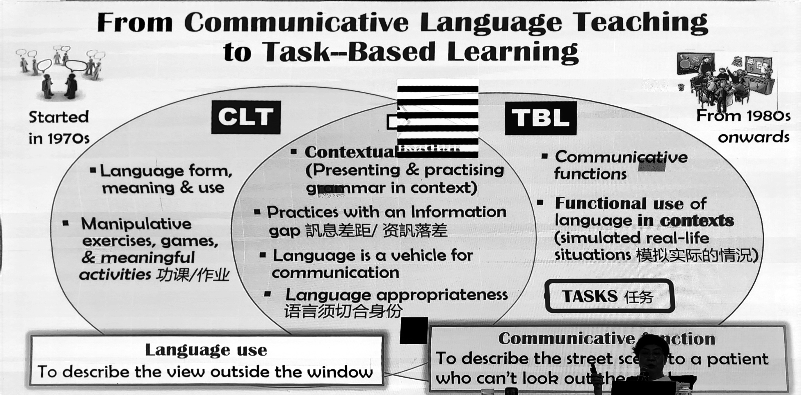
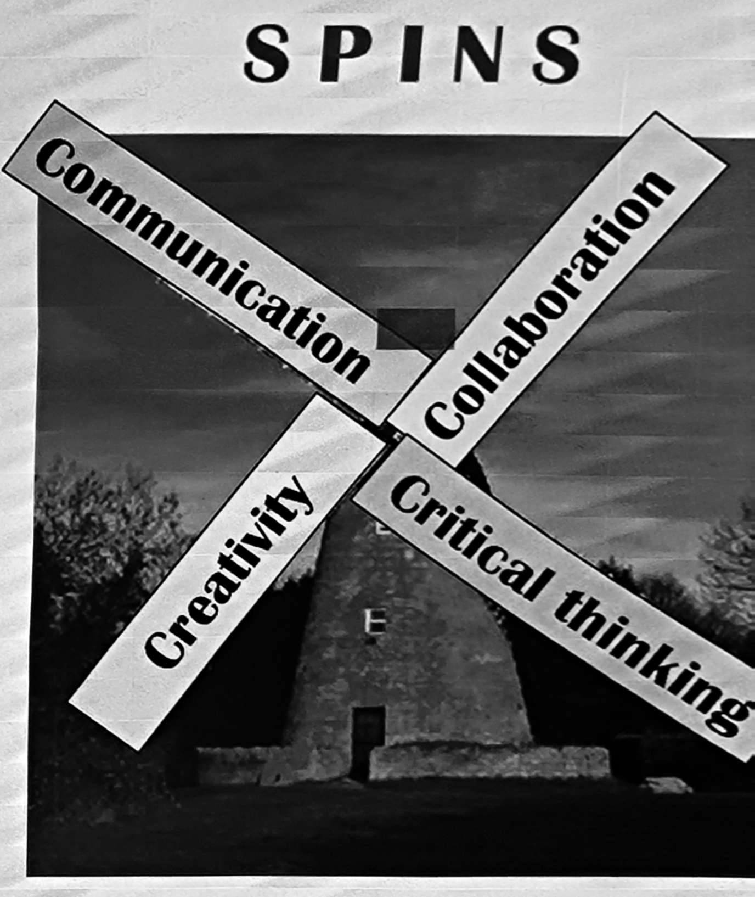
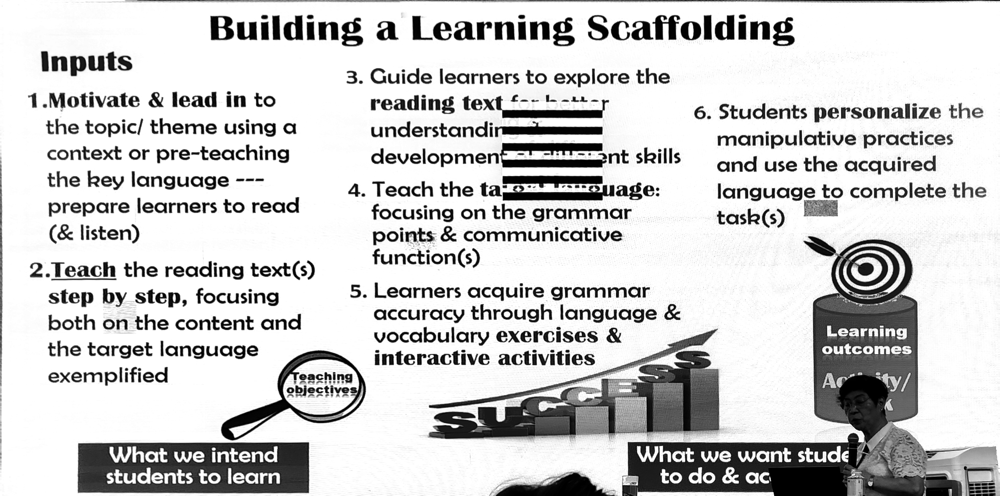
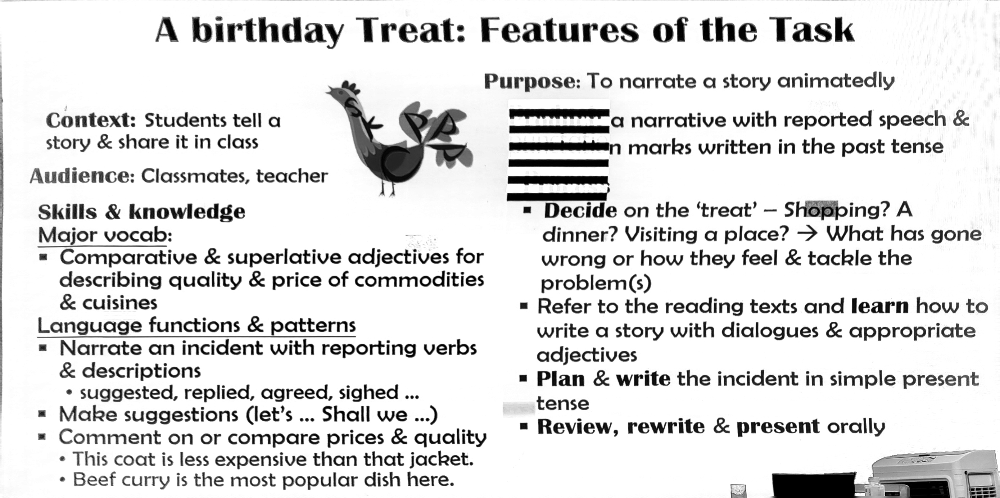

# Task-Based Teaching (Lilian Downey)

## Table of Contents

[[toc]]

## The History of ELT in Hong Kong

- Before the 1960s: Grammar Translation Method
- 1970s: Audio-Lingual Approach / Oral Structural Approach
- 1980s: Communicative Language Teaching (CLT)
- 1990s: Task-Based Learning Approach
- 2000s: Skills-Based / Genre-Based Teaching
- 2010s: Language Teaching Across the Curriculum
  - IT in Education
  - 21st Century Skills
  - Content and Language Integrated Learning (learning other subjects in English)
  - STEM / STEAM

## Methods

### Grammar Translation Method

e.g. 新概念英语

- Provide numerous examples and let children identify patterns.
- Focus solely on writing.
- Children learn about the language system, not its practical use.

### Audio-Lingual Approach

e.g. 英语 上海教育出版社

- Children learn vocabulary.
- Children imitate and watch; teachers act, and children identify.
- Emphasises listening and speaking.
- Target patterns are unnatural with little or no real meaning.

### Communicative Language Teaching

- Teach language in a communicative context.
- Provide a realistic context for the teaching sentences (e.g. a boy with a broken leg asks a girl what she can see outside the window).

### Task-Based Teaching

- Features: Context, Purpose, Process, Product, Skills & Knowledge

## Modern Teaching Focus

### Focus 1: 21st Century Skills

- Core values of the 21st century:
  - Respect
  - Responsibility
  - Resilience
  - Integrity
  - Care and concern
  - Harmony
- Social and emotional competencies:
  - Self-awareness
  - Self-management
  - Social awareness
  - Responsible decision-making
  - Relationship management
- Social and civic awareness:
  - Civic literacy
  - Global awareness
  - Cross-cultural skills
  - Critical and inventive thinking
  - Communication, collaboration, information skills

### Focus 2: The 9 Generic Skills

- **C**ommunication skills
- **C**ollaboration skills
- **C**ritical thinking skills
- **C**reativity 
- **S**tudy skills
- **P**roblem-solving skills
- **I**nformation technology skills
- **N**umeracy skills
- **S**elf-management skills

('4Cs, spins' like a windmill with four blades spins.)

### Focus 3: Reading Across the Curriculum

- Learning English through other subjects (e.g. 'STEAM': Science, Technology, Engineering, Art, and Maths).
- Learning English through different text types.

### Focus 4: Values Education

Personal => Social => National => Cultural

## From English Teaching to English Education

### Language Skills & Components

- Skills: Listening, Reading, Speaking, Writing
- Components: Phonology, Lexis, Grammar

### Planning to Teach: Essential Considerations

- What to teach: The language focuses.
- Why teach it: Communicative functions.
- Who the learners are.
- What learners do at the end of the lesson: Exercises, activities, and/or tasks.
- How to support their learning: Scaffolding of learning.

### An Example of Task-Based Teaching

- A reason for the task.
- Step-by-step instructions:
  - Generating ideas (e.g. mind map).
  - Skill practice (e.g. letter structure).
- Analysis of the task:
  - Context: Corresponding with a friend.
  - Purpose: To inform something to the friend.
  - Process: Review facts about seasons and festivals; decide on one season and festival to write about; brainstorm ideas.
  - Product: A letter.
  - Skills & Knowledge: Vocabulary and sentences.
- Reading: Be Creative
  - Don't read directly. Try to engage children first.
  - While-reading stage: Read for gist and supporting details.
    - First reading: Summarise the gadget.
    - Second reading: Details.
    - Post-reading: Observe and extend learning.

## My Thoughts

Lilian explains the history, theory, and practical examples of modern language teaching.

Regarding the historical aspect, it's unfortunate that Lilian didn't have time to explain why the new methods are superior. For instance, the Grammar Translation Method is still used when teaching specific grammar points for the first time. Although we don’t use this method exclusively, many of its concepts remain relevant. Why, then, is it considered outdated? Lilian briefly mentioned that it only helps students learn about the language system, not its practical use. While this reason is intuitive, the lecture lacks detailed comparisons and experiments, which I am curious about.

In terms of practical examples, Lilian demonstrates how to create a complete task-based teaching activity. I found this very informative and now know what constitutes a comprehensive task section in my teaching.