# LEAP 2A L1

## Preparation

### Teacher's Preparation

- Textbooks & workbooks (9 books)
- name stickers (stick on the books)
- name cards (place on the desks)

### Kids' Preparation

- pencil box / pencil bag × 1
- pencil × 2
- eraser × 1
- red pen × 1
- highlighter × 2 (two colours)
- backpack / school bag × 1
- water bottle × 1
- coat / jacket / any warm cloth (because of air conditioner)

## Reward Ref

- name-printed pencils

## plan

- self introduction
- greeting (2 times)
  > let's do this again, because some children are playing with pencils.
- check textbooks and workbooks
  > At the beginning of the lesson let's check our books
  >
  > every one, let's check
  >
  > first, do you have your textbooks? all right show me. done (tick)
  >
  > two, your grammar book? ...
  >
  > so how many books do u have all together?
  >
  > before u go home, count
- Kids' Preparation
  > do u have these things today?
  >
  > if no, I want to see them next lesson.
  >
  > u need to take all your books here every day
  >
  > u need your schoolbag, your handbag or your bookcase
  >
  > and ...
- classroom rules

  > all right so at the beginning we need to talk about our classroom rules
  >
  > during the class
  >
  > u have to look at your teacher, that's right, **look at Karsten**
  >
  > just like right now some children are looking at their books
  >
  > ok look at me first
  >
  > two, your **mouth should read** during the class
  >
  > u should read your book
  >
  > u should discuss with your partners
  >
  > and your ears
  >
  > u should listen to Karsten
  >
  > every time if u want 2 say something, for example
  >
  > u want to answer my questions u should hands up
  >
  > ok hands up first raise your hands first
  >
  > what else? oh, I'm not feeling good I want to go pee pee or go poo poo
  >
  > hands up first

- intro

  > let's talk about some different places in our school
  >
  > in Sky, what places can u find? 在蓝天你们能看到什么？
  >
  > so yeah u can see many classrooms

  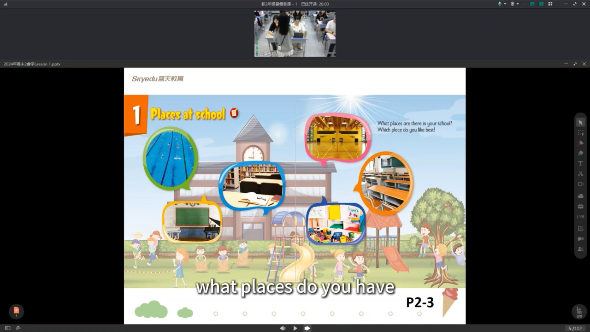

  - pick kids to tell the places in their school
  - introduce the images on the screen: what can we do there? what place is it?

  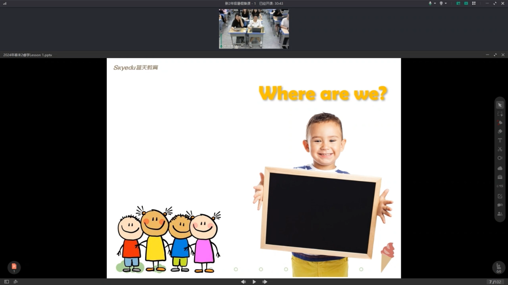

  - pick kids

  > all right so in this part let's do an activity well, i'll show you a picture and a sentence, okay when you see this, you know the answer but don't say out, don't say your answer out and then if you know, if you know, the answer put on your hands and weight what play is it

  - stand up answer

  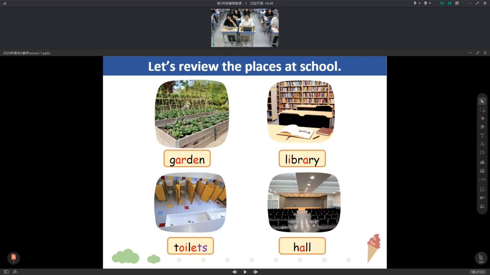

  - phonics
  - clap according to word's syllable

  

  - do u know more compound words?
  - bedroom, bathroom, basketball...

  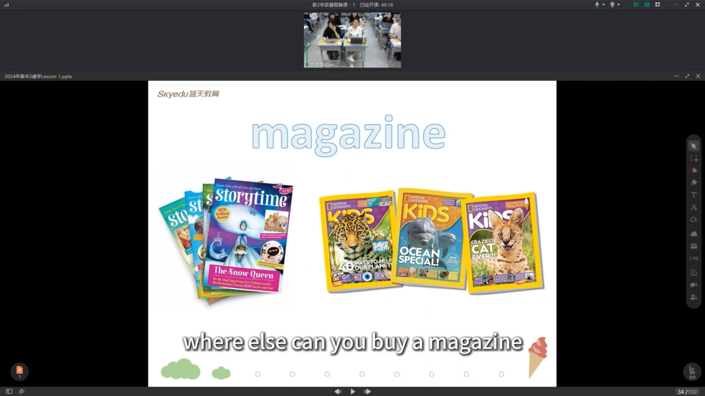

  - where can u buy or read a magazine?
  - library, reading room...

  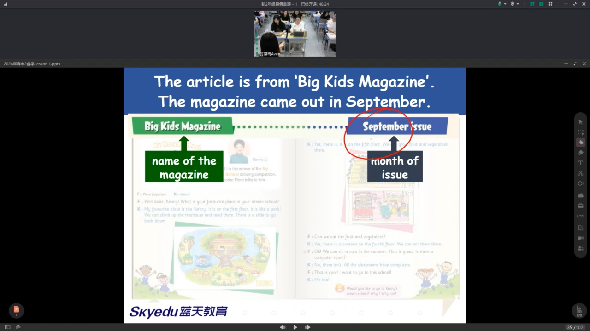

  - mention the months

  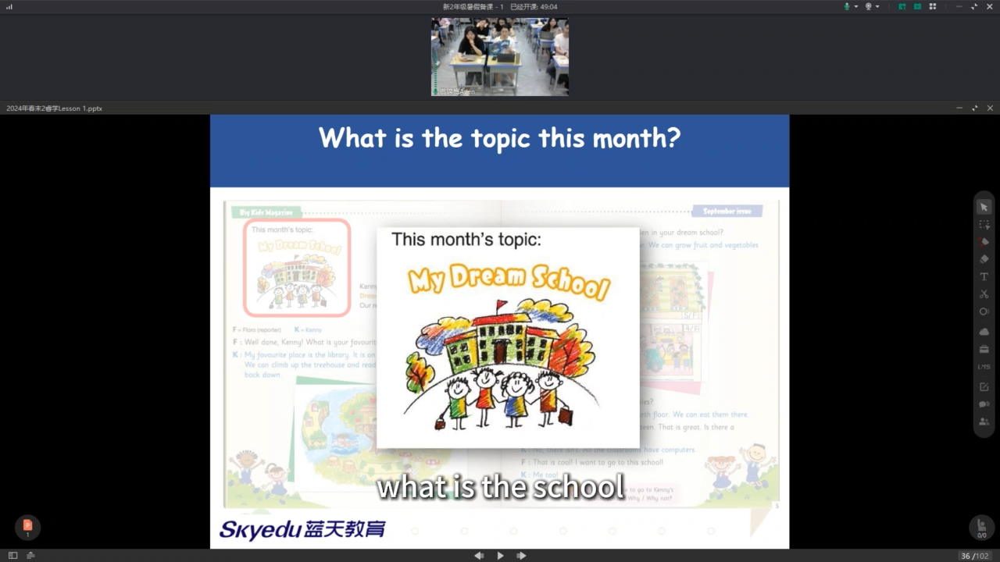

  - what is the school like in your mind?
  - beautiful, colourful ...

  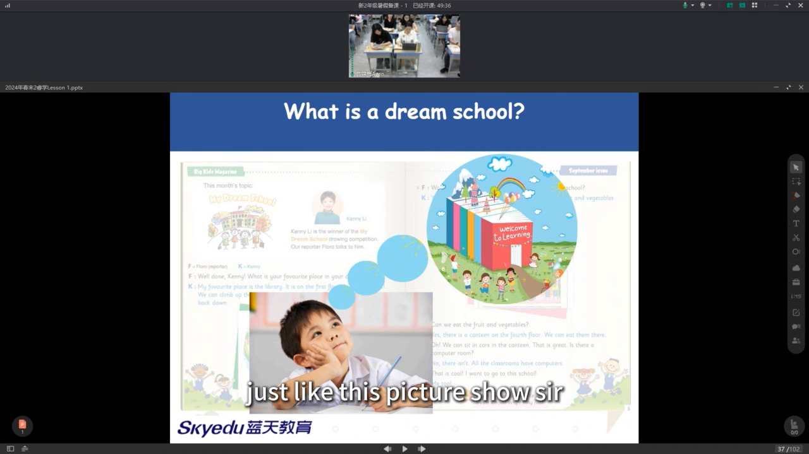

  > okay the topic is _my dream school_ and what is a dream school? let's see just like this picture show us can have anything you want

  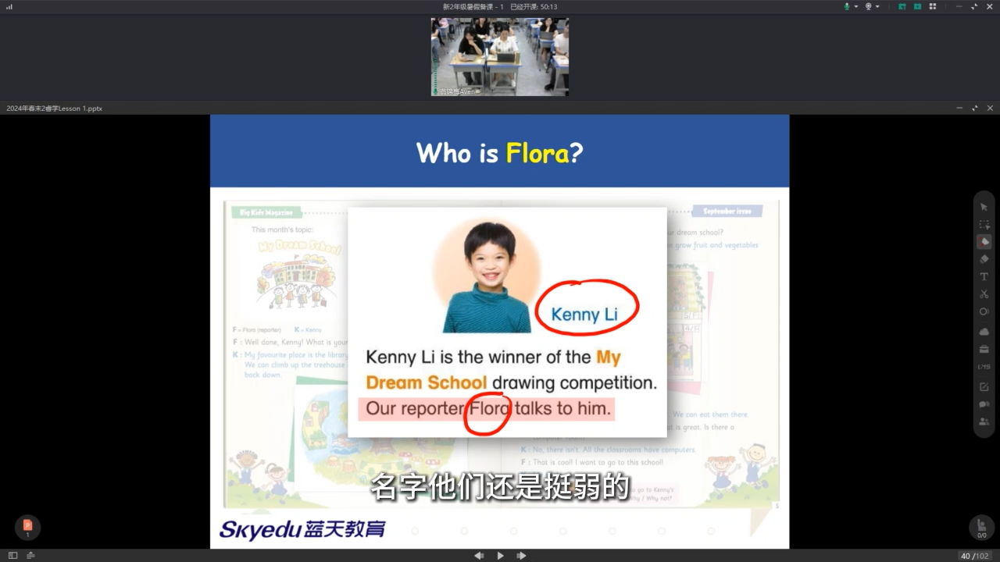

  - read the names more times

  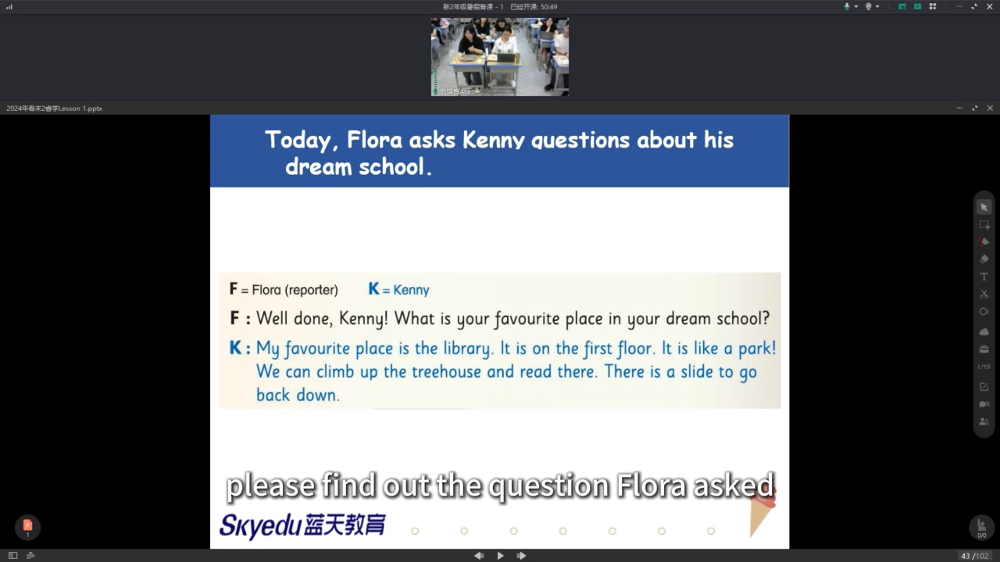

  - Please find out the question Flora asked. Can anyone come here and cirle it out?
  - and who can cirle the answer from Kenny Li?
  - (only let kids differentiate question and answer. no need to discuss deeper into the content of the answer)

- reading

  - first reading:

    - 播放录音，学生默读

    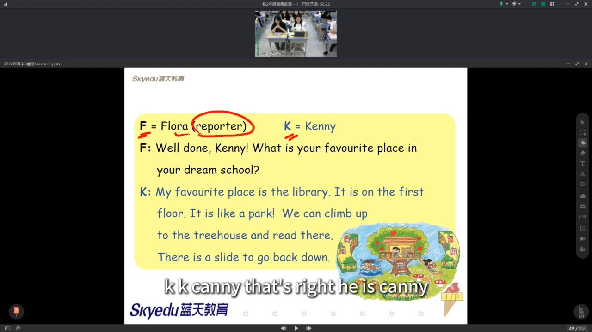

    - tell kids the meaning of `F` and `K`
    - simple questions

- second reading:
  - 播放录音，学生跟读
  - advanced questions
- third reading:

  - role-play (do this only when have more time)
  - extended knowledge
    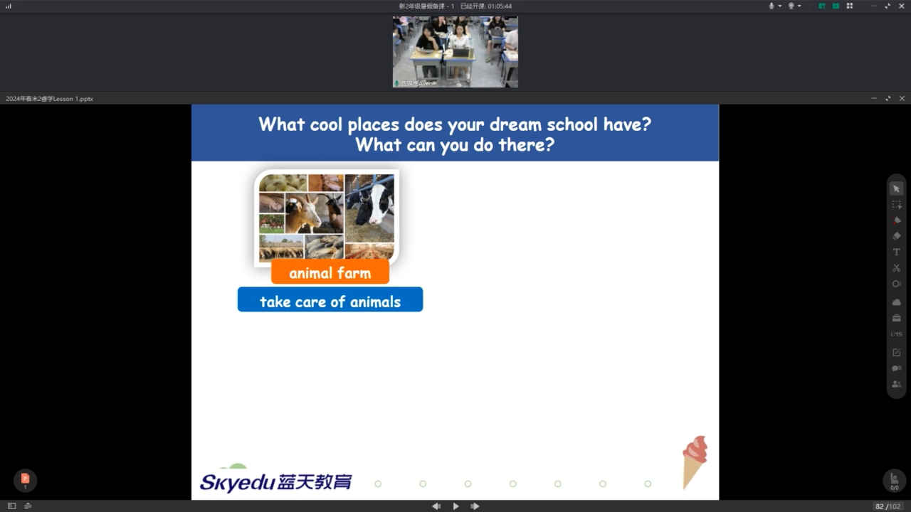
    > here are some ideas

- phonics
  - ask kids to give more examples including the learnt phonics part `pl` and `cl`

- homework

## others

- for games rules, less explaination, more examples
- clap softly, otherwise kids can't listen clearly
- little teacher - point to the text
- catch any chances that can say the teachers name so kids can remenber the name
- 'take out your textbook' (show the book at the same time)
