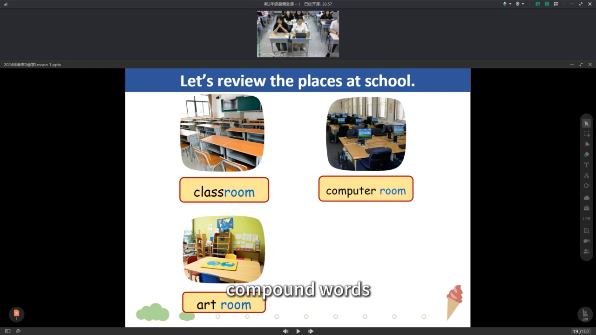

# LEAP 2A L1

## Preparation

### Teacher's Preparation

- Textbooks & workbooks (9 books)
- Name stickers (to stick on the books)
- Name cards (to place on the desks)

### Kids' Preparation

- Pencil box/pencil bag × 1
- Pencils × 2
- Eraser × 1
- Red pen × 1
- Highlighters × 2 (two colours)
- Backpack/school bag × 1
- Water bottle × 1
- Coat/jacket/any warm clothing (due to air conditioning)

## Rewards

- Name-printed pencils

## Plan

- Self-introduction
- Greeting (2 times)
  > Let's do this again, because some children are playing with their pencils.
- Check textbooks and workbooks
  > At the beginning of the lesson, let’s check our books.
  >
  > Everyone, let's check.
  >
  > First, do you have your textbooks? All right, show me. Done (tick).
  >
  > Second, your grammar book? ...
  >
  > So, how many books do you have altogether?
  >
  > Before you go home, count.
- Kids' Preparation
  > Do you have these things today?
  >
  > If not, I want to see them next lesson.
  >
  > You need to bring all your books every day.
  >
  > You need your school bag, your handbag, or your bookcase.
  >
  > And ...
- Classroom Rules

  > All right, so at the beginning, we need to talk about our classroom rules.
  >
  > During the class,
  >
  > You have to look at your teacher, that’s right, **look at Karsten**.
  >
  > Just like right now, some children are looking at their books.
  >
  > OK, look at me first.
  >
  > Second, your **mouth should read** during the class.
  >
  > You should read your book.
  >
  > You should discuss with your partners.
  >
  > And your ears,
  >
  > You should **listen to Karsten**.
  >
  > Every time you want to say something, for example,
  >
  > If you want to answer my questions, you should raise your hand.
  >
  > OK, raise your hand first.
  >
  > What else? Oh, if you are not feeling well and need to go to the toilet,
  >
  > Raise your hand first.

- Introduction

  > Let’s talk about some different places in our school.
  >
  > In Sky, what places can you find? 在蓝天你们能看到什么？
  >
  > So yes, you can see many classrooms.

  

  - Pick children to name the places in their school.
  - Introduce the images on the screen: What can we do there? What place is it?

  

  - Pick children.

  > All right, so in this part, let’s do an activity. I’ll show you a picture and a sentence. OK, when you see this, you know the answer but don’t say it out loud. If you know the answer, put up your hand and wait. What place is it?

  - Stand up and answer.

  

  - Phonics
  - Clap according to the word's syllables.

  

  - Do you know more compound words?
  - Bedroom, bathroom, basketball...

  

  - Where can you buy or read a magazine?
  - Library, reading room...

  

  - Mention the months.

  

  - What is the school like in your mind?
  - Beautiful, colourful...

  

  > OK, the topic is _My Dream School_. What is a dream school? Let’s see. Just like this picture shows us, it can have anything you want.

  

  - Read the names multiple times.

  

  - Please find the question Flora asked. Can anyone come here and circle it?
  - And who can circle the answer from Kenny Li?
  - (Only let children differentiate the question and answer. No need to delve deeper into the content of the answer.)

- Reading

  - First Reading:

    - Play the recording while students read silently.

    

    - Tell the children the meaning of `F` and `K`.
    - Simple questions.

  - Second Reading:
    - Play the recording while students read aloud.
    - Advanced questions.

  - Third Reading:
    - Role-play (do this only if there is extra time).
    - Extended knowledge.
    
    

    > Here are some ideas.

- Phonics
  - Ask children to give more examples including the learned phonics parts `pl` and `cl`.

- Homework

## Others

- For game rules, provide fewer explanations and more examples.
- Clap softly, otherwise, children can’t hear clearly.
- Little teacher - point to the text.
- Take any opportunity to say the teacher’s name so children can remember it.
- 'Take out your textbook' (show the book at the same time).