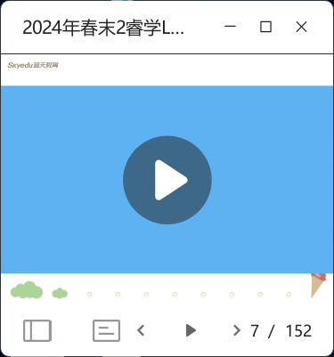
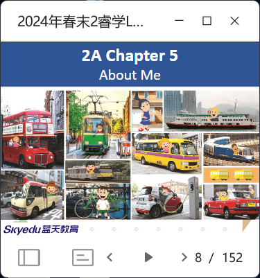
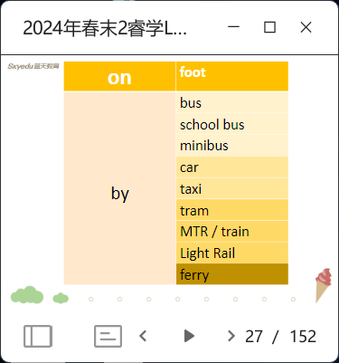
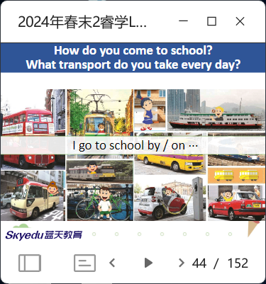
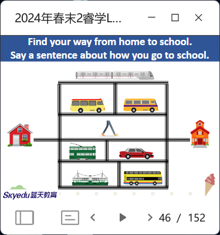
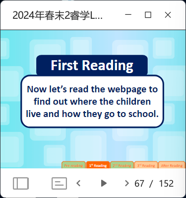
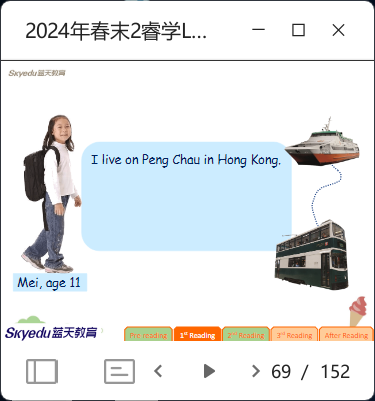
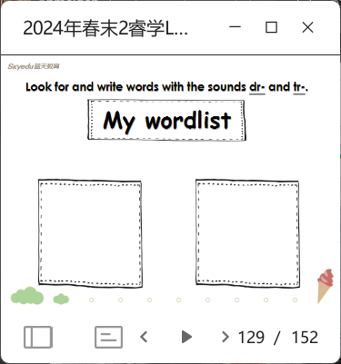

- let kids watch the video and tell what transpart can they remenber. 
- let kids say briefly
- 10s for kids to remenber the words and cover some letters 
- let kids share 
- example and kids try 
- listen 
- invite kids to read 
- let kids say 5 words and see who hits the most words in the slides 