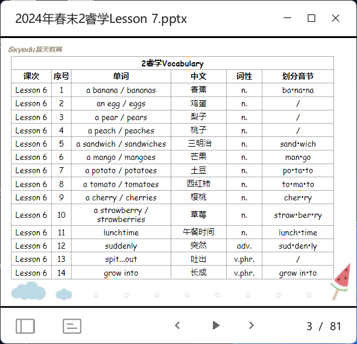

轮流读
简单讲讲单复数

- dictation
- song
- riddle (pick kids) (pretend kids are wrong, but actually right)
- reading review (pick kids read sentence by sentence)
- key structures (P31) note-taking
  - rule 1: +s
  - rule 2: +es (ending letter or letters: o, x, ch, sh, s => 公牛吃寿司/死神吃虾哦)
  - rule 3: -y +ies
- examples (pick kids to complete the 'I like ...' sentences)
- language focus 1 (P32)
  - read words
  - listen song number 1
  - listen song number 2,3,4 × 2
- 'Do u want some ...' (first one as an example and pick kids for others) note-taking
  - mention the diff of some and any
- Language focus 2 Part 1 (P34) (first one as an example and pick kids for others)
- Language focus 2 Part 2 (P35) work in pairs (explain in Chinese)
- reading (P10)
  1. fill in letters not words
  2. rhyme: same ending sound. e.g. pears/bears; hair/there
  3. refer: 指
  4. 10 min