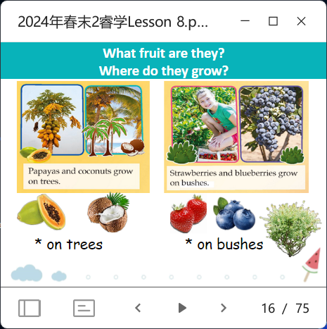

# LEAP 2A L8

- vocab
- intro
  - video
  - plural review
  - article recite
  - intro `poster`
  - read image; phonics; new words guessing 
  > I want to eat some strawberries; where can I get some? -- a fruit farm.
  >
  > let's go to the farm! follow me, everyone. Wait! Do u know where the farm is? so how can we know the place?
  >
  > let's check first. (call the phone) oh the farm is closed this year. We can't go.
  - quizs (reading booster)
    - explain
    > don't say the answer now. later u do the quizs yourselves
  - quizs (reading)
  - homework check