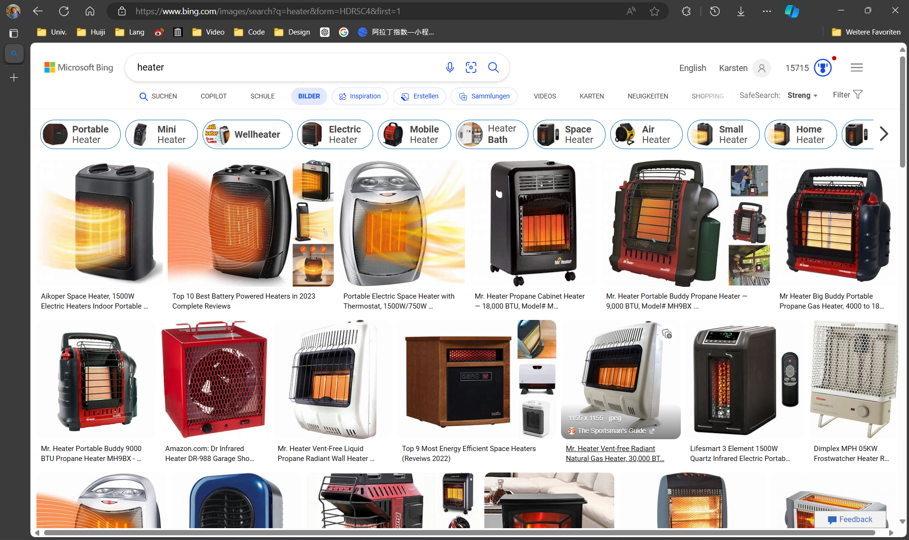

# LEAP 2A L9.md

- vocab
- intro video
    
    > let's have a PK. Let's see which group is louder.
- vocab learn and quick review
 
- 游戏：猜动作
- quizs
- 1st reading
  
  - ask kids to act (read with feeling)
  - passage video
  - 'luck' => act: walk and get some money !improvement requiring
- 2nd reading
- practice
- homework review