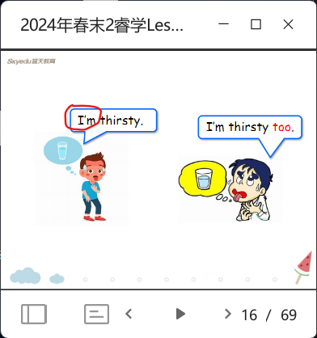
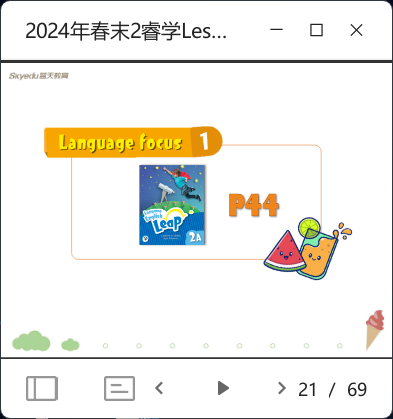
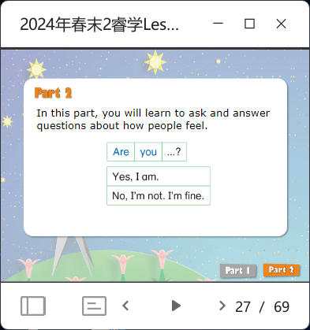

# LEAP A2 L10

- **vocab review**: thirsty vs. thirty 
  > are u thirsty or are u thirty?
- **reading review**
- **grammar**
  - an example
  - brief intro
  - more examples
  - mention `be` words 
  - before this slide, play a game. one kid in front of the classroom says `I'm ...` and another kid with the same feeling stands up and says `I'm ... too` and they hug each other. 
  - before this slide, sing a song (use E-book to play the song. Textbook page 44.). 
  > now I write down my feeling in the paper and do u want to know? yes? so how to ask?
  - for more practice, do a PK between groups. add points for the louder one.
- **Reading practice**