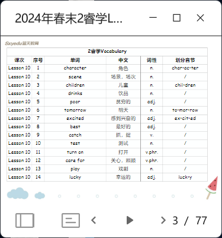

# LEAP A2 L11

- review
  - vocab review: use the words as clues to construct the reading passage
    
  - reading review: role play (give examples to tell kids acting with feeling)
- writing
  - review the elements of a play: title, characters, scenes.
  - scene 1 as an example and ask kids finish the beginning of scene 2
  - mind-map to lind all elements again before enter _Writing Booster_ part.
