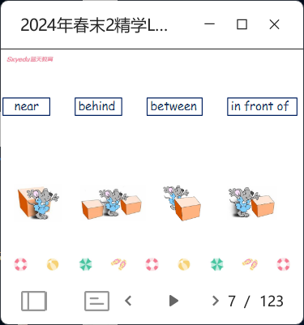
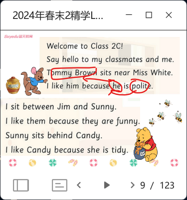
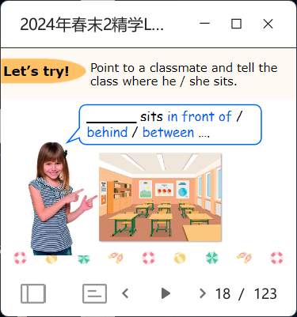
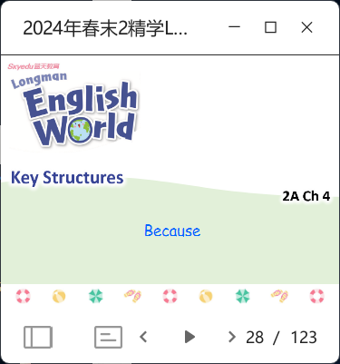
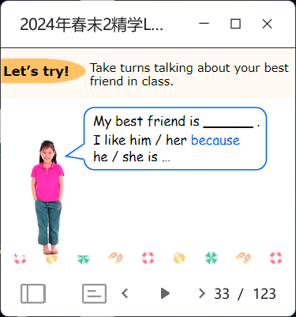
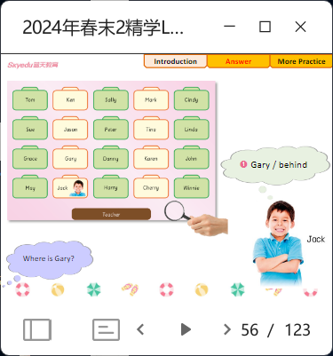
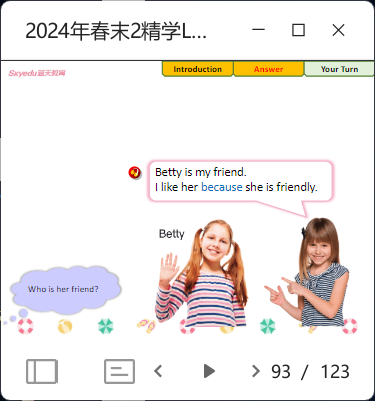

# LEW 2A L10

- group devide: group 1 clap your hands; group 2 stamp your feet
- vocab review: hidden bomb; clap and read, each word two times
- before this slide, play a game in SEEWO (skip others in the slides). 
- read and pick kids circle the adj. and prep. 
- give time for prepare and let kids say 
- before this slide, play a video 
- if kids can't say the name of classmates, let them say the teacher's name 
- give an example and give time for kids to prepare the rest to work in pairs 
- let kids talk about their classmates 