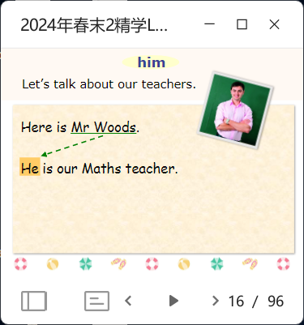
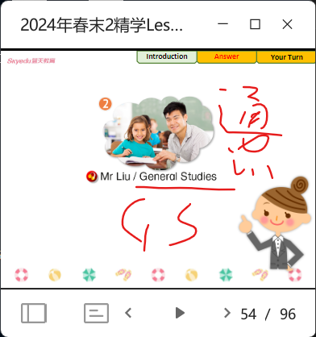

- review reading (boys and girls roleplay)
- word review (P13)
- video (focus on 'he' and 'she')
- who sentences (group by group read, intro there are two ways to express the answer) (if kids can't say, use practice 1 in P16)
- roleplay: the teacher asks A, A asks B, B asks C...
- grammar (show all examples first, then explain the reasons)
  
  > in english some words like I and me they have the same meanings
  > 主人最大，放动词前面。客人小，放动词后面。
  - add it=>it and they=>them
  - games: finding friends / saying subj. kids with obj. stand and say
  - Do u like (subject)? no I don't.
  - fill-in-the-blank quizs
- practice 2 (P17) (example and practice)
  
  -  roll dice to decide which picture and how many pointd
-  thank u card for teacher (print the printable material)
-  integrated practice (example and practice; underline refered people)