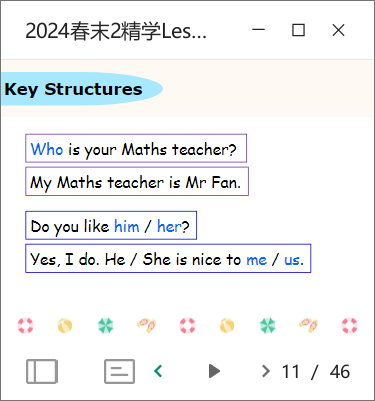
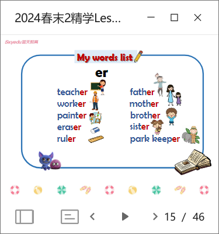
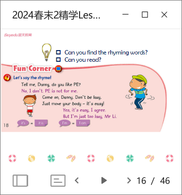
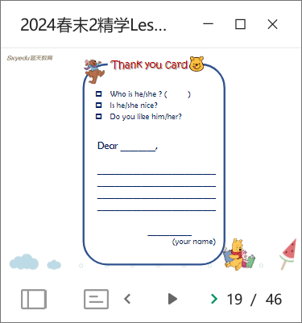
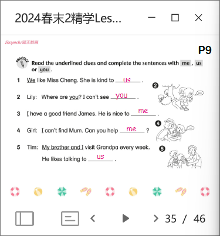

# LEW 2A L8

- vocab review
  - `c` makes `s` sound before `e`, `i`, `y`. e.g. recess, ...
- grammar review
  - 
  - play fill-in-the-blanks game
  - 
  - play who-read-faster game
  - 
  - intro ryhme; let kids find ryhming words after giving an example
  - 
  - do a new thank-you card if has time
- listening practice
- interagted practice
- homework check
  - 
  - ask kids say the reason after giving an example (why `us`? because at the beginning it says `we`)