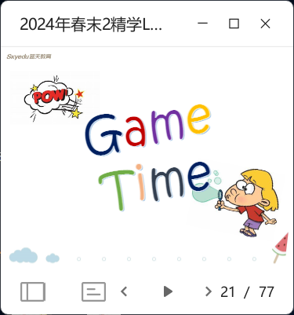
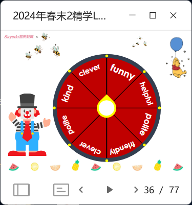

# LEW 2A L9

- intro video (stop to explain some words if neccessory)
- vocab learn
  
- vocab review (bomb game; roll call short time; E-book game)
- note-taking antonym of the learnt words
- direction preposition: song; let kids do guesstures with their pencils (note-taking: 'near' and 'next to' on page 19)
  
- reading
  - brief intro
  - play audio and then simple Q&A
  - ebook quick review all the mentioned kids
  - practice